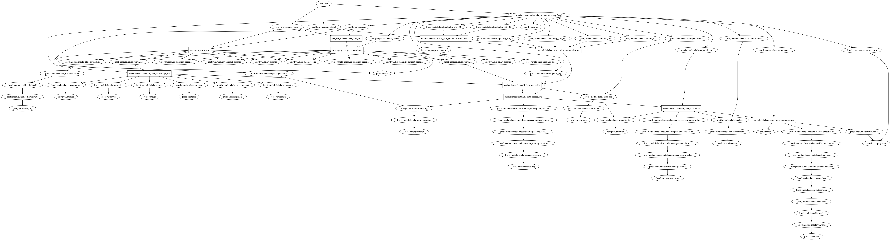

# terraform-aws-sqs

[](https://circleci.com/gh/appzen-oss/terraform-aws-sqs)
[](https://github.com/appzen-oss/terraform-aws-sqs/releases)

Terraform module to manage multiple SQS queues and optionally associated
dead letter queues

[Terraform registry](https://registry.terraform.io/modules/appzen-oss/sqs/aws)

## Usage

### Basic Example

```hcl
module "" {
  source        = "appzen-oss/sqs/aws"
  version       = "0.0.1"
}
```

<!-- BEGINNING OF PRE-COMMIT-TERRAFORM DOCS HOOK -->
## Inputs

| Name | Description | Type | Default | Required |
|------|-------------|:----:|:-----:|:-----:|
| attributes | Suffix name with additional attributes (policy, role, etc.) | list | `<list>` | no |
| component | TAG: Underlying, dedicated piece of service (Cache, DB, ...) | string | `"UNDEF-SQS"` | no |
| delay\_seconds | The time in seconds that the delivery of all messages in the queue will be delayed | string | `"0"` | no |
| delimiter | Delimiter to be used between `name`, `namespaces`, `attributes`, etc. | string | `"-"` | no |
| dlq\_delay\_seconds | Dead letter queue: The time in seconds that the delivery of all messages in the queue will be delayed | string | `""` | no |
| dlq\_max\_message\_size | Dead letter queue: The limit of how many bytes a message can contain before Amazon SQS rejects it. | string | `""` | no |
| dlq\_message\_retention\_seconds | Dead letter queue: The number of seconds Amazon SQS retains a message | string | `""` | no |
| dlq\_visibility\_timeout\_seconds | Dead letter queue: The visibility timeout for the queue | string | `""` | no |
| enable | Set to false to prevent the module from creating anything | string | `"true"` | no |
| enable\_dlq | Setup dead letter queue | string | `"true"` | no |
| environment | Environment (ex: `dev`, `qa`, `stage`, `prod`). (Second or top level namespace. Depending on namespacing options) | string | n/a | yes |
| max\_message\_size | The limit of how many bytes a message can contain before Amazon SQS rejects it. | string | `"262144"` | no |
| message\_retention\_seconds | The number of seconds Amazon SQS retains a message | string | `"1209600"` | no |
| monitor | TAG: Should resource be monitored | string | `"UNDEF-SQS"` | no |
| namespace-env | Prefix name with the environment. If true, format is: [env]-[name] | string | `"true"` | no |
| namespace-org | Prefix name with the organization. If true, format is: [org]-[env namespaced name]. If both env and org namespaces are used, format will be [org]-[env]-[name] | string | `"false"` | no |
| organization | Organization name (Top level namespace) | string | `""` | no |
| owner | TAG: Owner of the service | string | `"UNDEF-SQS"` | no |
| product | TAG: Company/business product | string | `"UNDEF-SQS"` | no |
| service | TAG: Application (microservice) name | string | `"UNDEF-SQS"` | no |
| sqs\_queues | List of SQS queue base names | list | n/a | yes |
| tags | A map of additional tags | map | `<map>` | no |
| team | TAG: Department/team of people responsible for service | string | `"UNDEF-SQS"` | no |
| visibility\_timeout\_seconds | The visibility timeout for the queue | string | `"600"` | no |

<!-- END OF PRE-COMMIT-TERRAFORM DOCS HOOK -->
<!-- BEGINNING OF PRE-COMMIT-TERRAFORM GRAPH HOOK -->

### Resource Graph of plan


<!-- END OF PRE-COMMIT-TERRAFORM GRAPH HOOK -->
